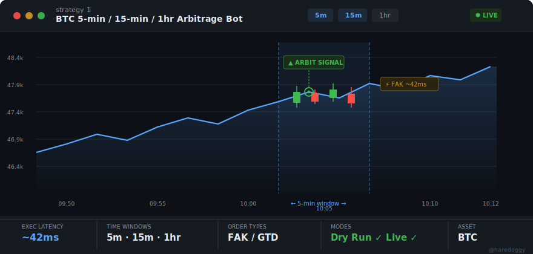
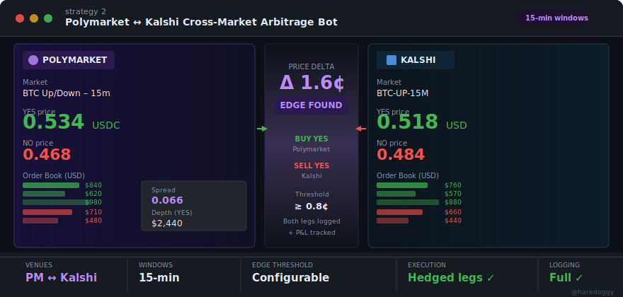
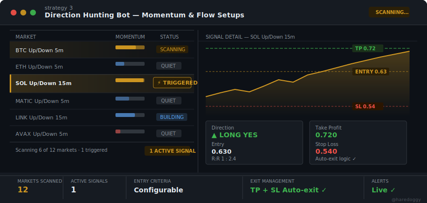
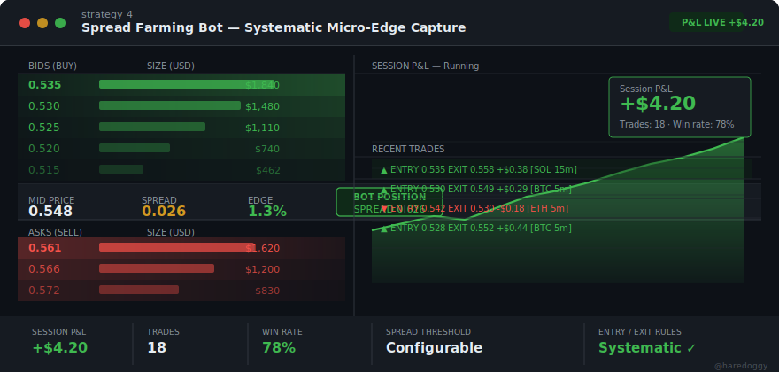
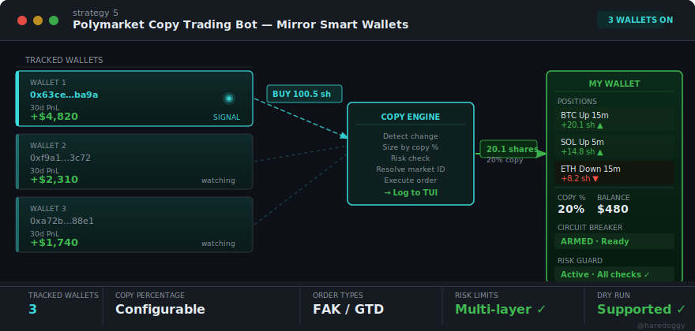
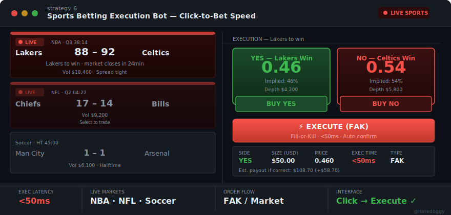
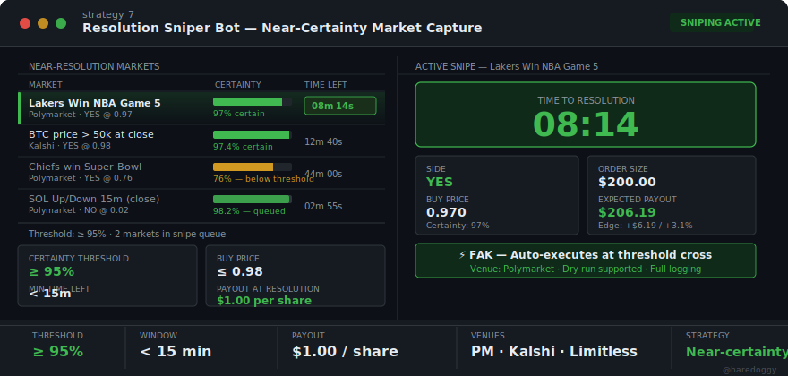
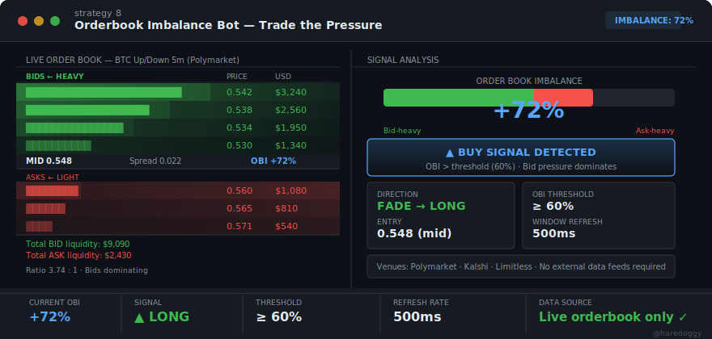
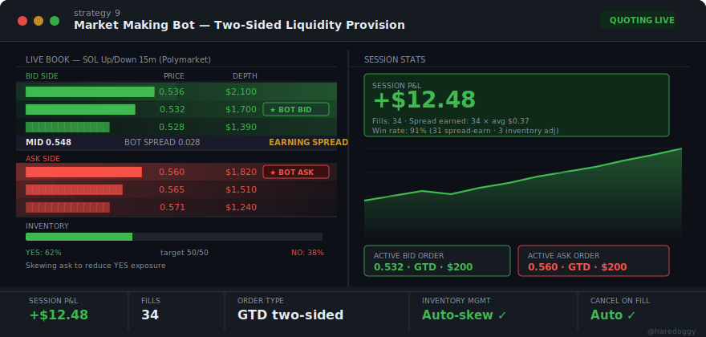
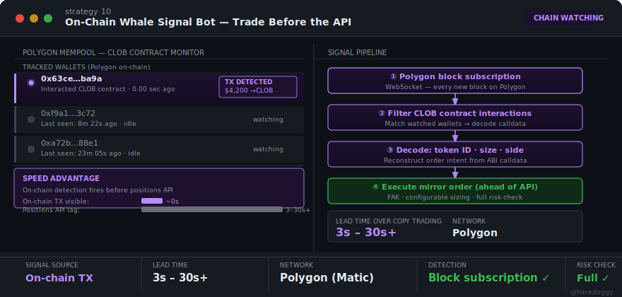

# Polymarket Toolkits

<div align="center">


### Multi-venue prediction market trading infrastructure — Polymarket · Kalshi · Limitless

[](https://www.rust-lang.org/)
[](LICENSE)
[](https://github.com)
[](https://tokio.rs/)
[](https://polymarket.com)
[](https://kalshi.com)
[](https://limitless.exchange)
[]()

[Strategies](#strategies) • [Engine](#engine-features) • [Quick Start](#installation) • [Configuration](#configuration) • [Architecture](#architecture) • [Safety](#safety--risk-management) • [Contact](#contact)

---

**🌐 Language / 语言:** [English](#polymarket-toolkits) • [简体中文](README.zh-CN.md)

</div>

---

## What This Is

A production-grade, Rust-built trading engine for prediction markets — [Polymarket](https://polymarket.com), [Kalshi](https://kalshi.com), and [Limitless](https://limitless.exchange). It ships with a real-time terminal UI, a fully functional copy trading bot, a multi-venue adapter layer, and an extensible architecture designed for traders who want to move fast without cutting corners on safety.

> **v1 ships copy trading.** Nine more strategies are actively in development across a venue-agnostic engine: BTC arb, cross-market arb (PM ↔ Kalshi), direction hunting, spread farming, sports execution, resolution sniping, orderbook imbalance, market making, and on-chain whale signals. All share the same Rust engine, risk layer, and TUI.

---

## Why This Exists

### The Market Changed

In early 2026, Polymarket removed the ~500ms artificial delay on taker orders for crypto markets. A small infrastructure change — but it invalidated an entire class of latency-sensitive strategies overnight. Micro-arbitrage, taker snipes, cancellation-window plays — all lost their structural edge.

The traders who adapted quickly pivoted to **signal following**: track wallets with consistent alpha, size into their positions, and let conviction do the work instead of microseconds.

This toolkit is that infrastructure. Built for the current market reality, not the one that existed six months ago.

### Why Rust?

Not for the marketing. For the guarantees.

Rust's ownership model eliminates entire categories of runtime failure before the binary ever runs. No garbage collection pauses at inopportune moments. No data races in concurrent order execution. No surprise crashes from null pointers mid-trade.

With Tokio powering the async runtime, the engine handles parallel position polling, order execution, and WebSocket streams without threading overhead — lean, predictable, and fast under pressure.

---

## Strategies

Six bots — each targeting a distinct edge. One shared engine underneath.

---

### 1. BTC 5-min / 15-min / 1hr Arbitrage Bot

> **Best for:** Traders who need speed on short-window BTC Up/Down markets



Watch BTC Up/Down markets across 5-minute, 15-minute, and 1-hour windows. When a pricing inefficiency or directional setup emerges, the bot places a low-latency FAK order before the window closes. Configurable dry-run and live execution modes let you validate behavior before committing real capital.

| | |
|---|---|
| **Markets** | BTC Up/Down — 5m, 15m, 1hr |
| **Order type** | FAK (Fill-or-Kill) |
| **Execution** | ~42ms end-to-end |
| **Modes** | Dry run + Live |
| **Status** | 🚧 In development |

[contact](https://t.me/haredoggy)
---

### 2. Polymarket ↔ Kalshi Cross-Market Arbitrage Bot

> **Best for:** Exploiting cross-venue pricing inefficiencies on 15-min windows



Monitor the same market on both Polymarket and Kalshi simultaneously. When a configurable price delta (edge threshold) is detected, the bot executes hedged legs on both venues — buying the cheaper side and selling the expensive side — locking in the spread. Every execution and P&L outcome is logged for review.

| | |
|---|---|
| **Venues** | Polymarket ↔ Kalshi |
| **Windows** | 15-min |
| **Edge threshold** | Configurable (e.g. ≥ 0.8¢) |
| **Execution** | Hedged legs, both venues |
| **Logging** | Full P&L tracking |
| **Status** | 🚧 In development |

[contact](https://t.me/haredoggy)
---

### 3. Direction Hunting Bot

> **Best for:** Directional traders looking for short-window momentum and flow setups



Continuously scans multiple symbols and time windows for setups matching your criteria. When a signal triggers, the bot enters the position and manages the exit automatically — take-profit and stop-loss levels are configurable. Real-time alerts notify you of new signals whether you're watching the terminal or not.

| | |
|---|---|
| **Scan universe** | Configurable market list |
| **Windows** | 5m, 15m (configurable) |
| **Entry criteria** | Configurable momentum / flow rules |
| **Exit management** | TP + SL, auto-exit logic |
| **Alerts** | Real-time signal notifications |
| **Status** | 🚧 In development |

[contact](https://t.me/haredoggy)
---

### 4. Spread Farming Bot

> **Best for:** Traders looking for systematic, repeatable micro-edges



Farm the bid-ask spread with disciplined, rule-based entries and exits. The bot sits at the spread, waits for fill conditions to align, and executes with consistent sizing. Every trade is logged with P&L, building a running session record that makes it easy to evaluate performance and tune parameters over time.

| | |
|---|---|
| **Strategy type** | Market-making / spread capture |
| **Entry / exit** | Configurable rules, systematic |
| **Logging** | Per-trade P&L + session totals |
| **Edge type** | Bid-ask spread, repeatable |
| **Status** | 🚧 In development |

[contact](https://t.me/haredoggy)
---

### 5. Polymarket Copy Trading Bot

> **Best for:** Copying top wallets automatically with configurable sizing and risk limits



Track one or more high-performing wallets and automatically mirror their BUY and SELL actions. Copy percentage, minimum trade size, and circuit breaker thresholds are all configurable — so you control how closely you follow the signal and how much risk you take on. The only fully released bot in the toolkit; everything else builds on the infrastructure it established.

| | |
|---|---|
| **Tracked wallets** | Multiple simultaneous |
| **Copy sizing** | Configurable percentage |
| **Order types** | FAK / GTD |
| **Risk limits** | Circuit breaker + depth guard |
| **Dry run** | Fully supported |
| **Status** | ✅ Production-ready |

[contact](https://t.me/haredoggy)
---

### 6. Sports Betting Execution Bot

> **Best for:** Manual traders who want click-to-bet speed on live sports markets



A focused live-sports interface that combines real-time odds display with fast FAK execution. Select a match, choose YES or NO, set your size, and hit Execute — the order is placed in under 50ms. Built for traders who make manual decisions but want the execution speed and reliability of an automated system behind the click.

| | |
|---|---|
| **Sports** | NBA, NFL, Soccer, and more |
| **Interface** | Live scoreboard + real-time odds |
| **Order flow** | FAK / market-style |
| **Execution** | < 50ms |
| **Mode** | Click-to-execute |
| **Status** | 🚧 In development |

[contact](https://t.me/haredoggy)
---

### 7. Resolution Sniper Bot

> **Best for:** High win-rate, low-variance plays unique to prediction markets



Scans all active markets for outcomes trading at near-certainty prices — configurable threshold (e.g. ≥ 95% YES or ≤ 5% NO). When a market enters the snipe window with sufficient time before resolution, the bot buys the near-certain side and holds to the guaranteed $1.00 payout. No equivalent exists in traditional finance; high win rate, low variance, best paired with strict sizing limits.

| | |
|---|---|
| **Certainty threshold** | Configurable (e.g. ≥ 95%) |
| **Window** | Configurable (e.g. < 15 min to resolution) |
| **Max buy price** | Configurable cap |
| **Payout** | $1.00 per share at resolution |
| **Venues** | Polymarket · Kalshi · Limitless |
| **Status** | 🚧 In development |

[contact](https://t.me/haredoggy)
---

### 8. Orderbook Imbalance Bot

> **Best for:** Pure order-flow signal, no external data required



Monitors the live bid/ask depth ratio (Order Book Imbalance = OBI) across configured markets. When OBI exceeds a configurable threshold in either direction, the bot fades into the dominant side — buying into heavy bids, selling into heavy asks. Signal is derived entirely from the live orderbook at a 500ms refresh rate, making this strategy self-contained and independent of any external feed.

| | |
|---|---|
| **Signal source** | Live orderbook only |
| **OBI threshold** | Configurable (e.g. ≥ 60%) |
| **Refresh rate** | 500ms |
| **Direction** | Fade the dominant side |
| **Venues** | Polymarket · Kalshi · Limitless |
| **Status** | 🚧 In development |

[contact](https://t.me/haredoggy)
---

### 9. Market Making Bot

> **Best for:** Passive spread income on illiquid prediction markets



Continuously quotes both sides of illiquid markets, earning the spread passively. Unlike Spread Farming (opportunistic taker entries), this bot *is* the book — sitting on both bid and ask simultaneously with GTD orders. Inventory skewing automatically adjusts quote prices to rebalance YES/NO exposure when one side fills too heavily. Auto-cancels the opposite side on a fill.

| | |
|---|---|
| **Strategy type** | Two-sided GTD quoting |
| **Order management** | Auto-cancel on fill, auto-requote |
| **Inventory control** | Configurable skew limits |
| **Sessions** | Full per-fill P&L + win rate tracking |
| **Venues** | Polymarket · Kalshi |
| **Status** | 🚧 In development |

[contact](https://t.me/haredoggy)
---

### 10. On-Chain Whale Signal Bot

> **Best for:** Fastest possible signal — 3–30 seconds ahead of the positions API



Subscribes directly to Polygon block data and filters for transactions from tracked large wallets interacting with the Polymarket CLOB contract. When a whale TX lands on-chain, the bot decodes the calldata (token ID, size, side) and mirrors the order immediately — typically 3–30 seconds before the change appears in the public positions API. This is the highest-fidelity, lowest-latency signal source available on Polymarket.

| | |
|---|---|
| **Signal source** | Polygon on-chain block subscription |
| **Lead time** | 3–30 seconds over positions API |
| **Detection** | ABI calldata decoding |
| **Network** | Polygon (Matic) |
| **Risk check** | Full circuit breaker + depth guard |
| **Status** | 🚧 In development |

[contact](https://t.me/haredoggy)
---

## Engine Features

### Core

| | Capability |
|---|---|
| **Copy Trading Bot** | Tracks multiple wallets simultaneously, mirrors position changes with configurable sizing |
| **Terminal UI** | `ratatui`-powered TUI with real-time log streaming, color-coded severity, and bot selection |
| **FAK / GTD Orders** | Fill-or-Kill and Good-Till-Date order types with automatic market ID resolution |
| **Multi-wallet Tracking** | Poll any number of addresses concurrently with shared rate limiting |

### Safety & Risk

| | Mechanism |
|---|---|
| **Circuit Breaker** | Auto-halts after N consecutive large trades within a configurable time window |
| **Orderbook Depth Guard** | Validates liquidity before every order — no fills into thin books |
| **Dry Run Mode** | Full execution path runs without placing real orders — ideal for validation |
| **Trade Size Floor** | Minimum size enforcement to avoid negative-EV micro-trades |

### Performance

| | Spec |
|---|---|
| **Event Processing** | < 1ms per event |
| **Order Execution** | < 100ms end-to-end |
| **Position Polling** | ~200ms per wallet |
| **Memory** | ~50MB baseline |
| **CPU** | < 5% on modern hardware |
| **Concurrency** | Semaphore-based rate limiting (default: 25 req / 10s) |

---

## Installation

### Prerequisites

- **Rust 1.70+** — [install here](https://www.rust-lang.org/tools/install)
- **Polymarket account** with USDC on Polygon
- **Exchange approval** — make at least one trade on [polymarket.com](https://polymarket.com) to approve USDC spending

### Build & Run

```bash
# Clone
git clone <repository-url>
cd Polymarket-Toolkits

# Production build (recommended)
cargo build --release
cargo run --release

# Debug build
RUST_LOG=debug cargo run
```

---

## Configuration

The project uses a **two-file split**: public settings in `config.json`, secrets in `config.yaml`.

```bash
cp config.yaml.example config.yaml
```

### `config.yaml` — Credentials (never commit)

```yaml
bot:
  private_key: "your_64_character_hex_private_key"   # No 0x prefix
  funder_address: "0x0000000000000000000000000000000000000000"
```

### `config.json` — All other settings

```json
{
  "bot": {
    "wallets_to_track": ["0x63ce342161250d705dc0b16df89036c8e5f9ba9a"],
    "enable_trading": false
  },
  "site": {
    "gamma_api_base": "https://gamma-api.polymarket.com",
    "clob_api_base": "https://clob.polymarket.com",
    "clob_wss_url": "wss://clob.polymarket.com"
  },
  "trading": {
    "copy_percentage": 20.0,
    "rate_limit": 25,
    "poll_interval": 5,
    "price_buffer": 0.00,
    "scaling_ratio": 1.00,
    "min_cash_value": 0.00,
    "min_share_count": 0.0
  },
  "risk": {
    "large_trade_shares": 1500.0,
    "consecutive_trigger": 2,
    "sequence_window_secs": 30,
    "min_depth_usd": 200.0,
    "trip_duration_secs": 120
  }
}
```

### Configuration Reference

**`bot`**
- `wallets_to_track` — Addresses to mirror
- `enable_trading` — `false` = monitor only, no orders placed

**`trading`**
- `copy_percentage` — What fraction of the tracked wallet's position size to replicate
- `poll_interval` — Seconds between position checks (lower = more responsive)
- `price_buffer` — Slippage tolerance on order price
- `scaling_ratio` — Multiplier applied on top of copy percentage

**`risk`**
- `large_trade_shares` — Share count that flags a trade as "large"
- `consecutive_trigger` — How many large trades in a row trigger the circuit breaker
- `sequence_window_secs` — Rolling window for consecutive trade detection
- `min_depth_usd` — Minimum orderbook liquidity required to proceed
- `trip_duration_secs` — Cooldown after circuit breaker fires

> **Security:** `config.yaml` is in `.gitignore` by default. For production deployments, use environment variables or a secrets manager — never store private keys in plaintext on shared systems.

---

## Usage

### First Run

1. Set `"enable_trading": false` in `config.json`
2. Run `cargo run --release` and confirm position detection is working
3. Review a few cycles of logs — verify the wallets and sizing look right
4. Set `"enable_trading": true` when ready

### TUI Controls

| Key | Action |
|-----|--------|
| `↑ / ↓` | Navigate bot menu |
| `Enter` | Launch selected bot |
| `q` | Quit |
| `Esc` | Return from bot view |

### What the Logs Look Like

```
[2026-02-16 10:30:45] INFO    Initializing Copy Trading Bot...
[2026-02-16 10:30:46] INFO    Tracking 0x63ce34... — 15 open position(s)
[2026-02-16 10:30:51] INFO    BUY detected: 100.5 shares — "Bitcoin Up or Down"
[2026-02-16 10:30:51] INFO    Copying: btc-updown-15m-1771884900 → 20.1 shares
[2026-02-16 10:30:52] SUCCESS  Order confirmed. ID: 0x1234...
```

---

## Architecture

The codebase is organized around three layers: **venue adapters** (per-platform API clients), **shared services** (execution, caching, risk), and **bots** (thin strategy orchestrators that compose services).

```
src/
├── main.rs                          # Entry point + TUI orchestration
├── lib.rs                           # Core library exports
│
├── config/
│   ├── mod.rs                       # AppConfig — unified config (json + yaml)
│   ├── settings.rs                  # All config structs and defaults
│   └── coin.rs                      # Coin/market selection helpers
│
├── venues/                          # Per-venue API adapter layer
│   ├── mod.rs                       # VenueId, Side, MarketRef — shared types
│   ├── polymarket/
│   │   └── mod.rs                   # Re-exports existing service layer
│   ├── kalshi/
│   │   ├── mod.rs
│   │   └── client.rs                # Kalshi REST client + order types
│   └── limitless/
│       ├── mod.rs
│       └── client.rs                # Limitless on-chain client (Base)
│
├── bot/                             # Strategy implementations
│   ├── mod.rs                       # Module exports + status legend
│   ├── copy_trading.rs              # ✅ Copy trading (production-ready)
│   ├── arbitrage.rs                 # 🚧 BTC Up/Down arb (5m / 15m / 1hr)
│   ├── cross_market_arb.rs          # 🚧 Cross-venue arb (PM ↔ Kalshi)
│   ├── direction_hunting.rs         # 🚧 Momentum/flow scanner + TP/SL
│   ├── spread_farming.rs            # 🚧 Systematic spread capture
│   ├── sports_execution.rs          # 🚧 Click-to-FAK sports interface
│   ├── resolution_sniper.rs         # 🚧 Near-certainty market sniping
│   ├── orderbook_imbalance.rs       # 🚧 OBI-driven order flow signal
│   ├── market_maker.rs              # 🚧 Two-sided GTD liquidity provision
│   └── whale_signal.rs              # 🚧 On-chain Polygon TX monitoring
│
├── service/                         # Shared execution services
│   ├── client.rs                    # Polymarket CLOB client + auth
│   ├── trader.rs                    # CopyTrader execution engine
│   ├── positions.rs                 # Position polling + change detection
│   ├── orders.rs                    # FAK/GTD order placement
│   ├── market_cache.rs              # Market metadata cache (slug → token ID)
│   ├── token.rs                     # Token ID helpers
│   └── price_feed.rs                # Cross-venue real-time price aggregation
│
├── ui/
│   ├── layout.rs                    # TUI layout + keyboard events
│   └── components/logs.rs           # Log entry rendering
│
├── utils/
│   ├── keyboard.rs                  # Raw terminal input
│   ├── risk_guard.rs                # Circuit breaker + multi-layer risk
│   └── orderbook.rs                 # OBI, spread, depth analysis helpers
│
└── models.rs                        # Shared data types
```

### Execution Flow (Copy Trading Bot)

```
Config load (config.json + config.yaml)
    ↓
CopyTrader init — authenticated Polymarket CLOB client
    ↓
Position poll loop  (every poll_interval seconds)
    ↓
Diff: previous state vs current state
    ↓
For each delta:
    ├─ Size calculation  (copy_percentage × tracked size)
    ├─ Market ID resolution  (Gamma API, cached)
    ├─ Risk guard check  (circuit breaker + depth)
    └─ Order execution  (FAK/GTD, concurrent, rate-limited)
    ↓
Cache update → repeat
```

### Design Principles

- **Async-first** — all I/O through Tokio; no blocking in the hot path
- **Venue-agnostic bots** — strategies reference `venues::VenueId`, not API-specific types
- **Thread-safe shared state** — `Arc<Mutex<T>>` for position cache and circuit breaker
- **Modular services** — bots are thin orchestrators; execution logic lives in services
- **Fail loudly** — `anyhow::Result` propagation with full context on every error path
- **Minimal allocations** — stack buffers preferred; heap only where necessary

---

## Safety & Risk Management

### Circuit Breaker

Fires automatically when:
- `consecutive_trigger` large trades (≥ `large_trade_shares`) occur within `sequence_window_secs`
- Orderbook depth falls below `min_depth_usd`

Once tripped, all order execution is blocked for `trip_duration_secs`. The trip state and cooldown are logged and visible in the TUI.

### Recommendations

| Stage | Action |
|-------|--------|
| Initial setup | Run with `enable_trading: false` for at least one full session |
| First real trades | Keep `copy_percentage` at 5–10% until you trust the signal |
| Ongoing | Watch circuit breaker trips — they surface execution anomalies |
| Production | Use a dedicated wallet with only the capital you intend to deploy |

---

## Troubleshooting

**`Failed to parse positions response as JSON`**
→ Verify `data_api_base` URL and API reachability. Check rate limits.

**`Failed to get market_id for slug`**
→ Check `gamma_api_base`, network connectivity, and API limits.

**`Trade execution returned None`**
→ Confirm `enable_trading: true`, sufficient USDC balance, and exchange approval.

**`INSUFFICIENT_BALANCE/ALLOWANCE`**
→ Approve exchange on Polymarket.com. Confirm `funder_address` matches your proxy wallet.

**`RISK_BLOCKED`**
→ Circuit breaker is active. Wait for cooldown or review `trip_duration_secs`.

**TUI not rendering**
→ Terminal must support ANSI colors. Minimum recommended size: 80×24.

---

## Contributing

Pull requests are welcome. Before submitting:

```bash
cargo fmt --check
cargo clippy -- -D warnings
cargo test
```

Branch naming: `feature/`, `fix/`, `refactor/` prefixes preferred.

---

## Contact

Built and maintained actively — if you're working on Polymarket tooling, algorithmic strategies, or want to collaborate:

<div align="center">

| Platform | Link |
|----------|------|
| **Discussions** | [GitHub Discussions](../../discussions) |
| **Telegram** | [@haredoggy](https://t.me/haredoggy) |


*Response time is typically within a few hours. Open to questions, feedback, and serious collaborations.*

</div>

---

## Acknowledgments

- [py-clob-client](https://github.com/Polymarket/py-clob-client) — reference implementation for CLOB interactions
- [Tokio](https://tokio.rs/) — async runtime
- [Alloy](https://github.com/alloy-rs/alloy) — Ethereum primitives
- [ratatui](https://github.com/ratatui-org/ratatui) — terminal UI framework

---

## Disclaimer

> Trading prediction markets involves real financial risk. This software is provided as-is, without warranty or guarantee of any outcome. It is not financial advice. Always test with `enable_trading: false` before deploying real capital. Ensure compliance with Polymarket's terms of service and applicable regulations in your jurisdiction.

---

<div align="center">

[](LICENSE)

**Built for the Polymarket community**

[Back to top](#polymarket-toolkits)

</div>
